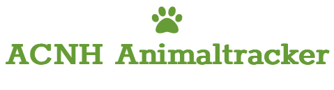

 

`acnhanimaltracker` is an easy way to to track your progress of catching all available animals in  Animal Crossing New Horizons.

The goal of this project is to get an easy to use application to track your status of caught animals in the game. Therefore it is important that the program is simple while still providing fast and reliable information.

All of this project is a work-in-progress and subject to change.

Constructive criticism and contributions are well appreciated.

**Table of Contents**
---
+ [Key Features](#key-features)
+ [Quick Demo](#quick-demo)
+ [Usage](#usage)
+ [Installation Options](#installation-options)
+ [How to contribute](#how-to-contribute)
+ [License](#license)
+ [Donations](#donations)

**Key Features**
---
+ keep track of the current status [caught/uncaught] of all animals in ACNH
+ keep track of key information like when and where to catch an animal or how much it's worth or what the surcharge price is
+ have a visual representation of an uncaught animal (<i>might help sometimes</i>)

**Quick Demo**
---


Currently only tested on MacOS Monterey.

**Usage**
---

```
Use the left mouse button to select or deselect caught animals.
To go back to the main menu use the backspace button.
```

```Python
# in main.py

if __name__ == "__main__":
    root_directory = os.path.dirname(__file__)
    animal_handler = AnimalHandler(root_directory)
    # animal_handler.reset_animals(True, True, True) # <- uncomment this line only on your first run or if you want to reset your progress
    animal_list = animal_handler.load_animals()
    # animal_handler.download_images(animal_list) # <- uncomment this line only on your first run
    app = Application(animal_list, root_directory)
    app.mainloop()
    animal_handler.save_animals(animal_list)
```


**Installation Options**
---

1. Clone this repository.
    + `cd ~/your/project/path`
    + `git clone https://github.com/fchehade/acnhanimaltracker.git`

2. Change directory `cd` to the acnhanimaltracker root directory.
3. Create a virtual environment and install requirements.txt
    + `python3 -m venv .env`
    + `source .env/bin/activate`
    + `pip install requirements.txt`
4. Afterwards, just run `python3 main.py` <i>First run will take a while to complete due to downloading image data.</i>
5. If you want to reset your progress just uncomment these lines in `main.py`:
```python
if __name__ == "__main__":
    root_directory = os.path.dirname(__file__)
    if not is_folder_structure_intact(root_directory):
        animal_handler = AnimalHandler(root_directory)
        animal_handler.reset_animals(True, True, True)
        animal_list = animal_handler.load_animals()
        animal_handler.download_images(animal_list)
    else:
        animal_handler = AnimalHandler(root_directory)
        # animal_handler.reset_animals(True, True, True)   <--
        animal_list = animal_handler.load_animals()
        # animal_handler.download_images(animal_list)      <--
    
    app = Application(animal_list, root_directory)
    app.mainloop()
    animal_handler.save_animals(animal_list)
```

**How to Contribute**
---

1. Clone repo and create a new branch: `$ git checkout https://github.com/fchehade/acnhanimaltracker -b name_for_new_branch`.
2. Make changes and test
3. Submit Pull Request with comprehensive description of changes

**License**
---
This project is licensed under [MIT](LICENSE)

**Donations**
---

This is free, open-source software. If you'd like to support the development of future projects, or say thanks for this one, you can donate at [Paypal](https://www.paypal.me/decalift) or [buy me a coffee](https://www.buymeacoffee.com/decalift).

<a href="https://www.paypal.me/decalift"></a>&nbsp; &nbsp; <a href="https://www.buymeacoffee.com/decalift" target="_blank"></a>